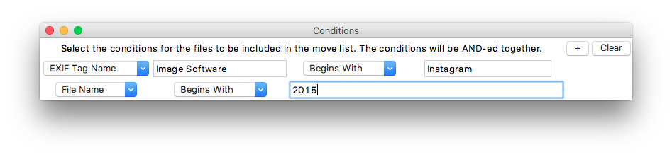

#Photo Organizer
##Key Features
- Filter out photos by any EXIF key
- Rename photos with custom format
- Move photos into a organized folder structure

## Image Name Format
|Keyword | Explanation         | Example |
|--------|---------------------|---------|
|YYYY    | Full Year           | 2016    |
|MM      | Month with a 0 when applicable|05|
|DD      | Day with a 0 when applicable|14|
|hh      | Hour with a 0 when applicable|07|
|mm      | Minute with a 0 when applicable|48|
|ss      | Second with a 0 when applicable|44|
|uuu     | Milliseconds with zeros in front when applicable|005|

## Folder Structure
You can use all keywords available in the Image Name Format field. The forward slash '/' signifies a new folder.

Look at this format for example: ```"YYYY/MM/DD"```.

In this case, all photos taken on the same day will be put in the same folder. ```2016/05/16/IMG-0500.JPG```

# Conditions
To filter files out of the Camera Uploads folder, open the window in Options -> Conditions.


---
Creator: Bergþór Þrastarson.